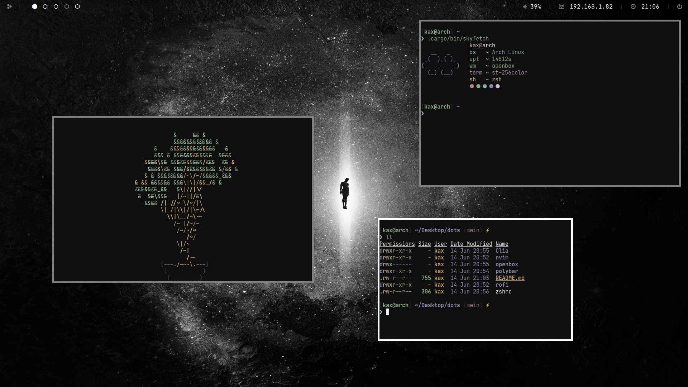

# dots



```zsh

# Go into the home folder.
cd ~

# Install dependencies from AUR (some might be missing).
yay -S neovim openbox polybar rofi zsh nerd-fonts-victor-mono pulseaudio nitrogen

# Set zsh as the default shell.
chsh -s /bin/zsh

# Install OMZ.
sh -c "$(curl -fsSL https://raw.github.com/ohmyzsh/ohmyzsh/master/tools/install.sh)"

# Install zsh plugins.
git clone https://github.com/zsh-users/zsh-autosuggestions $ZSH/plugins/
git clone https://github.com/zsh-users/zsh-syntax-highlighting/ $ZSH/plugins/

# Clone the dots.
git clone https://github.com/kaxtioucha/dots

# Install 'em.

mkdir .themes 2>/dev/null && cp -r dots/Clia .themes

cp -r dots/nvim .config
cp -r dots/openbox .config
cp -r dots/polybar .config
cp -r dots/rofi .config
```
